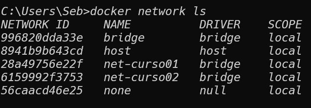
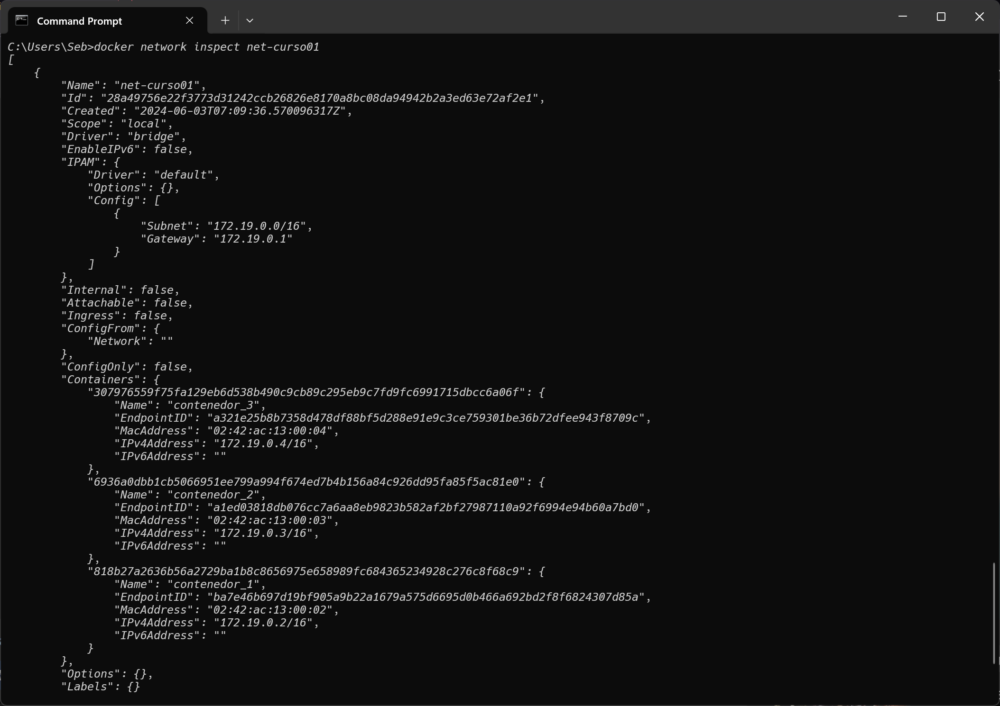
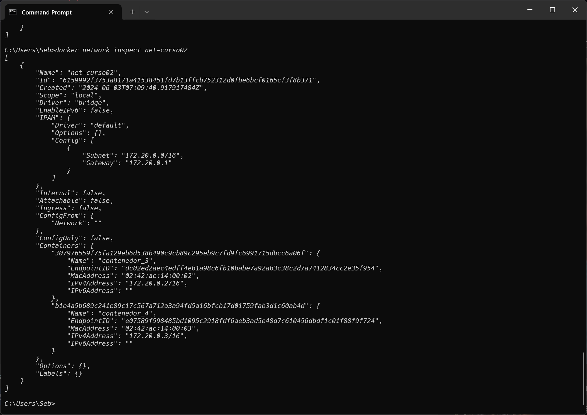
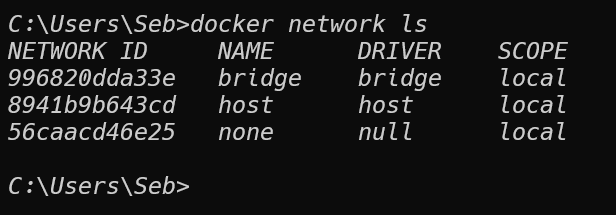

# Redes
Las redes son un componente fundamental que permite la comunicación entre contenedores, así como la comunicación de los contenedores con el mundo exterior.


- Bridge: Esta es la red por defecto en Docker. Permite la comunicación entre contenedores en el mismo host. Cada contenedor conectado a la red bridge tiene una IP propia en la subred de la red bridge.
    -  Brige por default: Cuando se ejecuta un contenedor, Docker crea automáticamente una red de tipo bridge por default. Esta red se utiliza para permitir la comunicación entre contenedores en el mismo host. Cada contenedor conectado a esta red obtiene su propia dirección IP en la subred de la red bridge.
    - Bridge creada por nosotros: Un usuario también puede crear sus propias redes de tipo bridge en Docker. Esto puede ser útil para organizar y segmentar los contenedores de una aplicación de manera más controlada. Al crear una red bridge personalizada, se puede especificar un rango de direcciones IP y otras configuraciones de red específicas. Los contenedores conectados a esta red utilizarán las direcciones IP de la subred definida por el usuario.
- Host: Con esta red, los contenedores comparten la red del host en lugar de tener su propia interfaz de red. Esto puede mejorar el rendimiento de red, pero los contenedores pueden entrar en conflicto con los puertos del host si intentan utilizar los mismos puertos.
- None: Con esta red, se deshabilita la configuración de red. Los contenedores que usan esta red tienen su propia red de bucle invertido y no pueden comunicarse con otros contenedores a menos que se conecten explícitamente a una red.

### Crear una red de tipo bridge

```
docker network create <nombre red> -d bridge
```

### Crear un contenedor vinculado a una red

```
docker run -d --name <nombre contenedor> --network <nombre red> <nombre imagen>
```

### Para saber a qué red está conectado un contenedor

```
docker inspect <nombre contenedor>
```
ó
```
docker network inspect <nombre red> 
```

### Vincular contenedor a una red
```
docker network connect <nombre red> <nombre contenedor>
```

### Para desvincular un contenedor de una red
```
docker network disconnect <nombre red> <nombre contenedor>
```

### Para listar las redes existentes
```
docker network ls
```

### Crear los contenedores y las redes que se presentan en el esquema. Usar para todos los contenedores la imagen de nginx:alpine


Creacion de las redes

```
docker network create net-curso01 -d bridge
```

```
docker network create net-curso02 -d bridge
```

Creacion de los contenedores

```
docker run -d --name contenedor_1 nginx:alpine
```

```
docker run -d --name contenedor_2 nginx:alpine
```

```
docker run -d --name contenedor_3 nginx:alpine
```

```
docker run -d --name contenedor_4 nginx:alpine
```
Conectar los contenedores a sus respectivas redes

```
docker network connect net-curso01 contenedor_1
```

```
docker network connect net-curso01 contenedor_2
```

```
docker network connect net-curso01 contenedor_3
```

```
docker network connect net-curso02 contenedor_3
```

```
docker network connect net-curso02 contenedor_4
```

# COLOCAR UNA CAPTURA DE LAS REDES EXISTENTES CREADAS



# COLOCAR UNA(S) CAPTURAS(S) DE LOS CONTENEDORES CREADOS EN DONDE SE EVIDENCIE A QUÉ RED ESTÁN VINCULADOS

Para poder ver los contenedores y las redes a las que estan vinculados, como conocemos a las redes a las que hemos conectado usaremos los siguientes comandos para poder ver los contenedores que esten conectados a esa red

```
docker network inspect net-curso01
```



```
docker network inspect net-curso02
```



# Eliminar las redes creadas

Para eliminar las redes primero debemos desconectar los contenedores que esten conectados

```
docker network disconnect net-curso01 contenedor_1
```

```
docker network disconnect net-curso01 contenedor_2
```

```
docker network disconnect net-curso01 contenedor_3
```

```
docker network disconnect net-curso02 contenedor_3
```

```
docker network disconnect net-curso02 contenedor_4
```

Unas vez que las redes esten "vacias" procedemos a eliminar las redes

```
docker network rm net-curso01
```

```
docker network rm net-curso02
```

comprobamos que las redes se eliminaron exitosamente listando las redes existentes



