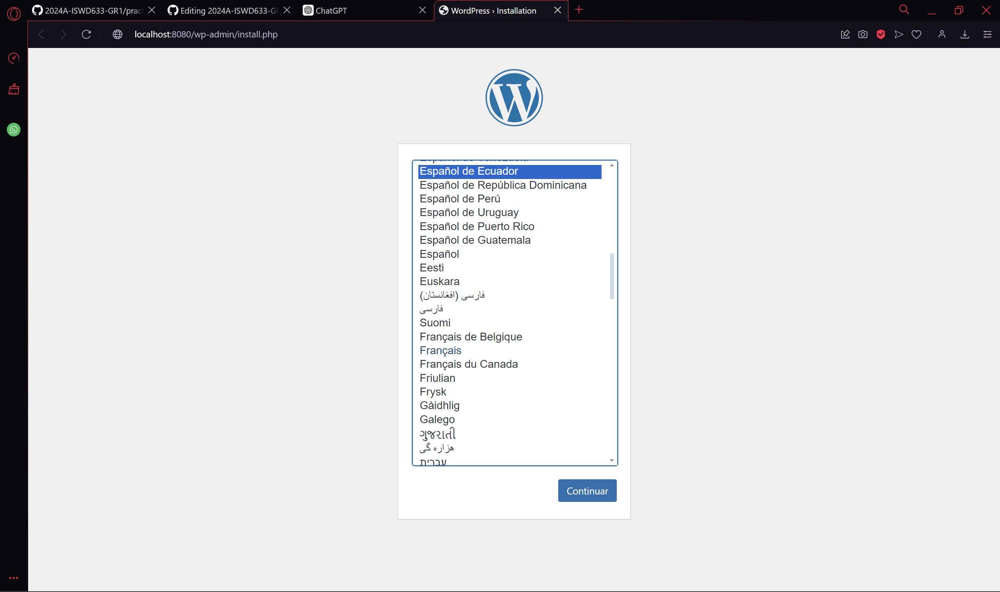
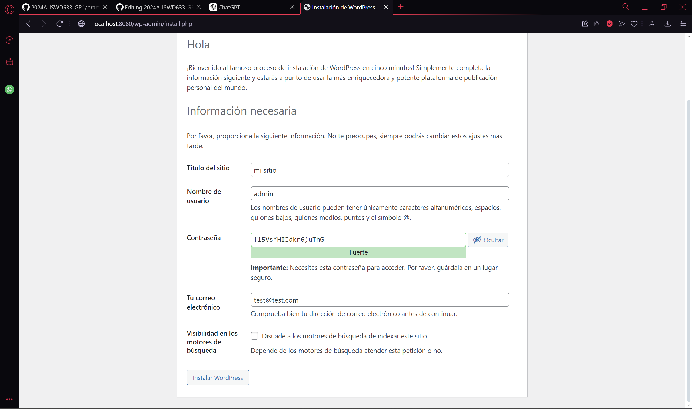
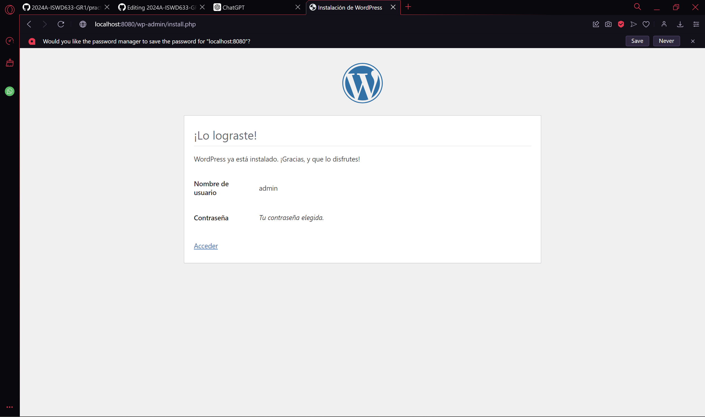

## Esquema para el ejercicio


### Crear la red

```
docker network create net-wp
```

### Crear el contenedor mysql a partir de la imagen mysql:8, configurar las variables de entorno necesarias

```
docker pull mysql:8
```

```
docker run -d --name mi_mysql --network net-wp -e MYSQL_ROOT_PASSWORD=rootpassword -e MYSQL_DATABASE=mi_base_de_datos -e MYSQL_USER=usuario -e MYSQL_PASSWORD=contraseña mysql:8
```

### Crear el contenedor wordpress a partir de la imagen: wordpress, configurar las variables de entorno necesarias

```
docker pull wordpress
```

```
docker run -d --name wordpress --network net-wp -e WORDPRESS_DB_HOST=mi_mysql:3306 -e WORDPRESS_DB_NAME=mi_base_de_datos -e WORDPRESS_DB_USER=usuario -e WORDPRESS_DB_PASSWORD=contraseña -p 8080:80 wordpress
```
De acuerdo con el trabajo realizado, en la el esquema de ejercicio el puerto a es **(completar con el valor)**

Ingresar desde el navegador al wordpress y finalizar la configuración de instalación.






Desde el panel de admin: cambiar el tema y crear una nueva publicación.
Ingresar a: http://localhost:9300/ 
recordar que a es el puerto que usó para el mapeo con wordpress
# COLOCAR UNA CAPTURA DEL SITO EN DONDE SEA VISIBLE LA PUBLICACIÓN.

### Eliminar el contenedor wordpress
# COMPLETAR

### Crear nuevamente el contenedor wordpress
Ingresar a: http://localhost:9300/ 
recordar que a es el puerto que usó para el mapeo con wordpress

### ¿Qué ha sucedido, qué puede observar?
# COMPLETAR


