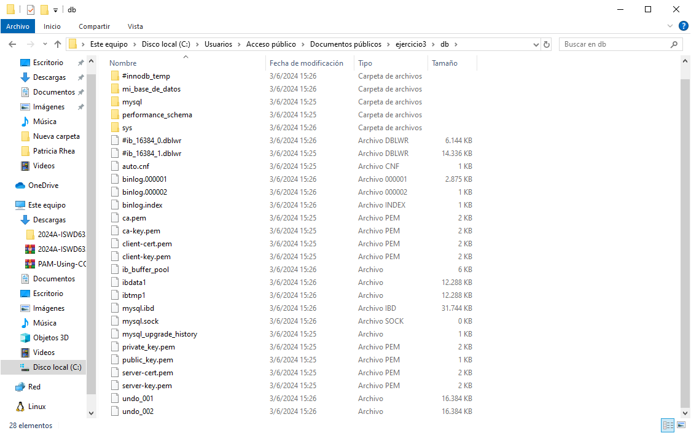

## Esquema para el ejercicio


### Crear red net-wp

```
docker network create net-wp
```

### Para que persista la información es necesario conocer en dónde mysql almacena la información.
# COMPLETAR LA SIGUIENTE ORACIÓN. REVISAR LA DOCUMENTACIÓN DE LA IMAGEN EN https://hub.docker.com/)
En el esquema del ejercicio la carpeta contenedor mysql es /var/lib/mysql
Ruta carpeta host: .../ejercicio3/db

### ¿Qué contiene la carpeta db del host?

En la carpeta db del host, no existe nada.

### Crear un contenedor con la imagen mysql:8  en la red net-wp, configurar las variables de entorno: MYSQL_ROOT_PASSWORD, MYSQL_DATABASE, MYSQL_USER y MYSQL_PASSWORD

```
docker run -d --name mi_mysql --network net-wp -v C:\Users\Public\Documents\ejercicio3\db:/var/lib/mysql -e MYSQL_ROOT_PASSWORD=rootpassword -e MYSQL_DATABASE=mi_base_de_datos -e MYSQL_USER=usuario -e MYSQL_PASSWORD=contraseña mysql:8
```

### ¿Qué observa en la carpeta db que se encontraba inicialmente vacía?

Se puede observar que se crearon unos archivos pertenecientes a la base de datos que posiblemente sean archivos de base de datos de MySQL, configuraciones específicas de MySQL (si las hay), posiblemente scripts de inicialización o configuración específicos del entorno, etc.



### Para que persista la información es necesario conocer en dónde wordpress almacena la información.
# COMPLETAR LA SIGUIENTE ORACIÓN. REVISAR LA DOCUMENTACIÓN DE LA IMAGEN EN https://hub.docker.com/)
En el esquema del ejercicio la carpeta contenedor wordpress es /var/www/html
Ruta carpeta host: .../ejercicio3/www

### Crear un contenedor con la imagen wordpress en la red net-wp, configurar las variables de entorno WORDPRESS_DB_HOST, WORDPRESS_DB_USER, WORDPRESS_DB_PASSWORD y WORDPRESS_DB_NAME (los valores de estas variables corresponden a los del contenedor creado previamente)

```
docker run -d --name wordpress --network net-wp -e WORDPRESS_DB_HOST=mi_mysql:3306 -e WORDPRESS_DB_NAME=mi_base_de_datos -e WORDPRESS_DB_USER=usuario -e WORDPRESS_DB_PASSWORD=contraseña -v C:\Users\Public\Documents\ejercicio3\www:/var/www/html -p 9500:80 wordpress
```

R5*v9PJWhjh&wUu2WT
### Personalizar la apariencia de wordpress y agregar una entrada

###COMPLETAR

### Eliminar el contenedor y crearlo nuevamente, ¿qué ha sucedido?

```
docker rm -f wordpress
```

```
docker rm -f mi_mysql
```

```
docker run -d --name mi_mysql --network net-wp -v C:\Users\Public\Documents\ejercicio3\db:/var/lib/mysql -e MYSQL_ROOT_PASSWORD=rootpassword -e MYSQL_DATABASE=mi_base_de_datos -e MYSQL_USER=usuario -e MYSQL_PASSWORD=contraseña mysql:8
```

```
docker run -d --name wordpress --network net-wp -e WORDPRESS_DB_HOST=mi_mysql:3306 -e WORDPRESS_DB_NAME=mi_base_de_datos -e WORDPRESS_DB_USER=usuario -e WORDPRESS_DB_PASSWORD=contraseña -v C:\Users\Public\Documents\ejercicio3\www:/var/www/html -p 9500:80 wordpress
```

Al poder guardarse los datos dentro del volumen del host las personalizaciones realizadas se guardaron, y al conectar nuevamente al volumen los nuevos contenedores se cargan las caracteristicas creadas previamente.
